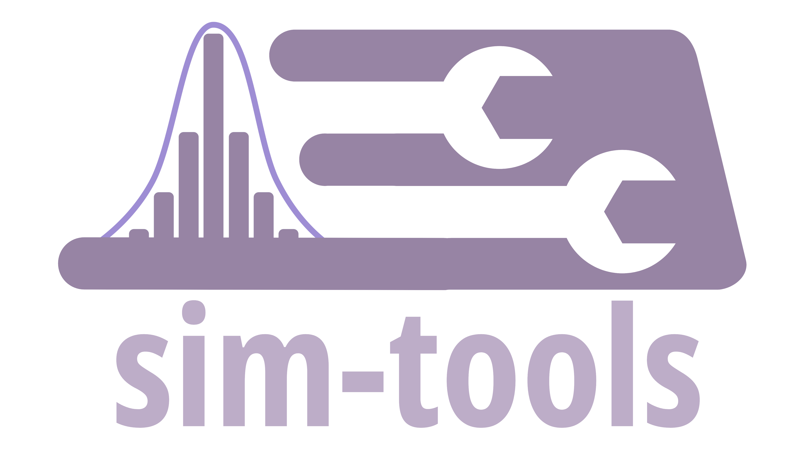

<h1 align="center">Tom Monks 🎓 🐍 🤖 🛠️ 🧠 📈</h1>

  I am currently an Associate Professor of Health Data Science at the <b>University of Exeter Medical School</b>.

  
  
  
  
  
  

## Reproducible Research in Healthcare AI and Data Science

I am an academic researcher and software engineer with a passion for improving healthcare service delivery (e.g. managing a emergency department or reducing delayed discharges from hospital) using mathematical modelling, AI, and open science. My expertise spans computer simulation, reproducibility, and the development of impactful, shareable computational tools. 

I've also been working hard to increase my skills in AI particularly around Autonomous Agents to interact with data science tools and Large Language Models for coding and reasoning.

## Impact of my work

👉 I believe that data science can make a huge difference to health services and patient outcomes. For example, 

* [my work in hyper-acute stroke care led to four times as many patients being treated in half the time.](https://www.sciencedirect.com/science/article/pii/S2211692314200348)
* [my work in using simulation to reduce delayed transfers of care saves the NHS an estimated £3.2m per year](https://www.tandfonline.com/doi/full/10.1080/17477778.2019.1664264#abstract) 💰💰💰
* [during the early stage of Covid-19 pandemic I worked with colleagues to support the NHS make rapid decisions in order to maintain treatment of vulerable patients with renal failure](https://journals.plos.org/plosone/article?id=10.1371/journal.pone.0237628)

👉 I believe that open and reproducible health data science leads to less research waste and better patient outcomes: 

* [my work developing reporting guidelines for simulation has helped 100's of authors improve the document their simulation studies](https://scholar.google.com/citations?view_op=view_citation&hl=en&user=0DFB5iYAAAAJ&citation_for_view=0DFB5iYAAAAJ:bEWYMUwI8FkC)
* [I'm actively working to support simulation researchers adopt Free and Open Source Software and build reusable model](https://github.com/pythonhealthdatascience)

## GitHub Organisations

As well as my personal GitHub I manage a several GitHub organisations. All code is openly licensed (MIT and GPL):

| Organisation                                          | Description                                                      |
|-----------------------------------------------------|------------------------------------------------------------------|
| [pythonhealthdatascience](https://github.com/pythonhealthdatascience)                       | Open tools for reproducible healthcare simulations in Python & R |
| [TheOpenScienceNerd](https://github.com/TheOpenScienceNerd)                                         | Code supporting my data science and open methods [YouTube channel](https://www.youtube.com/@TheOpenScienceNerd) ▶️ |
| [health-data-science-OR](https://github.com/health-data-science-OR) | My Python 🐍 teaching materials for Health Data Science

If you are interested in learning about reproducible AI and data science you can check out:

* ▶️ My YouTube channel [@TheOpenScienceNerd](https://www.youtube.com/@TheOpenScienceNerd) for beginner, intermediate and sometimes very detailed tutorials.
* 📖 My free online book Python for health data science: a hands-on introduction https://www.pythonhealthdatascience.com

## 🎓 Research Interests

- **AI & Intelligent Agents:** Exploring the use of generative AI and open weight language models to build intelligent agents that can use simulation and healthcare data science tools to support decision making in the NHS.
- **Open Science & Reproducibility:** Promoting open, reusable, and replicable research through transparent code sharing, protocol development, and best practices.
- **Healthcare Simulation Modeling:** Development and application of discrete-event simulation (DES), and Hybrid Agent and DES models in healthcare for capacity planning, and operations management.
- **Forecasting & Operations Research:** Improving healthcare decision-making with statistical forecasting and optimization.

## 🔑 Skills

- **Linux**:a full time user since 2016 🐧
- **Programming:** Python (since 2007 ⏳), R (proficient, but use less)
- **Simulation Modeling:** Discrete-Event Simulation (DES), agent-based modeling
- **Reproducible Workflows:** Research compendia, reproducible analytical pipelines
- **Machine Learning:** AI agent frameworks (beginner), large language models
- **Open Science Practices:** Code and data sharing, documentation, reproducibility assessments
- **Collaboration & Leadership:** PI on multi-disciplinary, multi-institutional projects

## 🚀 I am currently working on...

### 🤖 Generative AI, Autonomous Agents and Healthcare Simulation
**Role:** Principal Investigator.

Feasibility and pilot development work exploring how the rapid advancements in Generative AI and Agent workflows can exploited for
* Replicating simulation models from published descriptions and prompt engineering (where the original authors did not make code available)
* Boosting research producitivty and adhereance to open science best practices.
* Reasoning about simulation models and autonomous experimentation and reporting.

### 💫 STARS: Sharing Tools and Artefacts for Reproducible Simulations
**Role:** Principal Investigator  
A UKRI-funded project to advance the open sharing, reuse, and reproducibility of healthcare simulation models in Python and R.
- Developed guidance and frameworks for reproducible DES modeling[1].
- Published systematic reviews on the state of code sharing in healthcare simulation[1].
- Created templates and online resources for reusable simulation pipelines.

<h1 align="left">
  
</h1>

**Role:** Lead developer

Free and open source Python tools to support Discrete-Event Simulation and Monte-Carlo education and practice.

- Available to install via PyPI and conda-forge
- Theoretical and empirical distributions module that includes classes that encapsulate a random number stream, seed, and distribution parameters.
- An extendable Distribution registry that provides a quick reproduible way to parameterise simulation models.
- Implementation of Thinning to sample from Non-stationary Poisson Processes (time-dependent) in a DES.
- Automatic selection of the number of replications to run via the Replications Algorithm.
- Implementation of classic Optimisation via Simulation procedures such as KN, KN++, OBCA and OBCA-m

### SCOPE: Simulation for Coordination of Orthopaedic Patient Emergency Services
**Role:** Co-Investigator

This work has been supported by the [LEAP Digital Health Hub](https://leap-hub.ac.uk/about-the-hub), which has been funded by EPSRC under grant number EP/X031349/1.

- Led by Dr Alison Harper [aliharp](https://github.com/aliharp)
- Hybrid discrete-event simulation and agent based simulation of orthopeadic emergency surgery
- For more details [see our website](https://aliharp.github.io/SCOPE/).

## 🧑‍💻 Selected Repositories

| Repository                                   | Description                                                      |
|----------------------------------------------|------------------------------------------------------------------|
| [forecast-tools](https://github.com/TomMonks/forecast-tools)                               | Tools for forecasting processes in Python                        |
| [stars-streamlit-example](https://github.com/pythonhealthdatascience/stars-streamlit-example)                        | Open model of health treatment center operations deployed as a web app                |
| [llm_simpy](https://github.com/pythonhealthdatascience/llm_simpy) | Code for exploring the ability of LLMs to generate SimPy models and streamlit interfaces. |
| [llm_simpy_models](https://github.com/pythonhealthdatascience/llm_simpy_models) | The SimPy models and apps generated by LLMs, deployed as a single app. |
| [intro-open-sim](https://github.com/pythonhealthdatascience/intro-open-sim)                               | My popular WASM powered tutorial series introducing open-source simulation in Python                  |
| [des_rap_book](https://github.com/pythonhealthdatascience/des_rap_book)                                 | STARS output: Online step-by-step RAP simulation modeling book in collaboration with [amyheather](https://github.com/amyheather) [aliharp](https://github.com/aliharp)                |

## 🌱 Currently Learning

- FastMCP and Langchain to setup agentic workflows using external tools.

## 📬 Get in Touch

**Research Collaborations:** Reach out via my [Exeter staff profile](https://experts.exeter.ac.uk/19244-thomas-monks) or connect on [LinkedIn](https://www.linkedin.com/in/thomas-monks-a24aa22/)

**Open Source Projects:** Open an issue or start a discussion on any of my repositories

**Learning & Teaching:** Questions about my tutorials? Comment on my [YouTube videos](https://www.youtube.com/@TheOpenScienceNerd) or check the [online book](https://www.pythonhealthdatascience.com)

